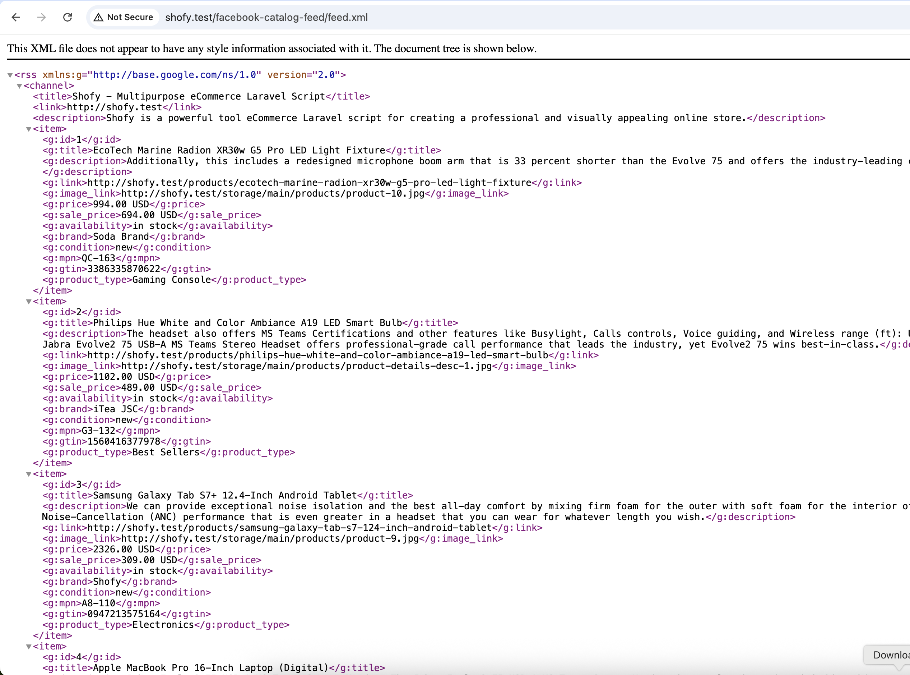

# Facebook Catalog Feed Plugin for Botble CMS

This plugin generates Facebook Catalog Feed XML for your e-commerce products, compatible with Facebook Commerce Manager and other platforms that support Google Shopping feed format.

This plugin is developed and maintained by [FriendsOfBotble](https://github.com/FriendsOfBotble).

## Features

- Generate XML product feed in Facebook/Google Shopping format
- Support for multiple feed types (all products, new, featured, on sale)
- Include/exclude out of stock products
- Support for product variations as separate items
- Configurable product conditions and availability status
- Admin dashboard widget for easy feed URL access
- Automatic category path generation
- Support for product images, prices, and sale prices

## Installation

1. Download the plugin
2. Extract to `platform/plugins/fob-facebook-catalog-feed`
3. Go to Admin Panel → Plugins → Activate the plugin
4. Navigate to E-commerce → Facebook Catalog Feed to configure settings

## Configuration

Available settings:

- **Enable/Disable**: Toggle the feed generation
- **Include out of stock products**: Choose whether to include products with zero stock
- **Include variations**: List product variations as separate feed items
- **Default brand**: Fallback brand name when products don't have a brand
- **Product condition**: Default condition (new, refurbished, used)
- **Availability texts**: Customize availability status messages

## Feed URLs

- All products: `https://yoursite.com/facebook-catalog-feed/feed.xml`
- New products: `https://yoursite.com/facebook-catalog-feed/feed.xml?type=new`
- Featured products: `https://yoursite.com/facebook-catalog-feed/feed.xml?type=featured`
- On sale products: `https://yoursite.com/facebook-catalog-feed/feed.xml?type=on_sale`

## Feed Format

The feed follows the Google Shopping/Facebook Catalog XML format with these fields:

- `g:id`: Product ID
- `g:title`: Product name
- `g:description`: Product description
- `g:link`: Product URL
- `g:image_link`: Main product image
- `g:additional_image_link`: Additional images
- `g:availability`: Stock status
- `g:price`: Product price
- `g:sale_price`: Sale price (if applicable)
- `g:brand`: Brand name
- `g:condition`: Product condition
- `g:mpn`: SKU
- `g:gtin`: Barcode
- `g:google_product_category`: Category hierarchy
- `g:product_type`: Product type
- `g:shipping_weight`: Product weight

## Requirements

- Botble CMS 7.0+
- E-commerce plugin activated
- PHP 8.0+

## License

The MIT License (MIT)